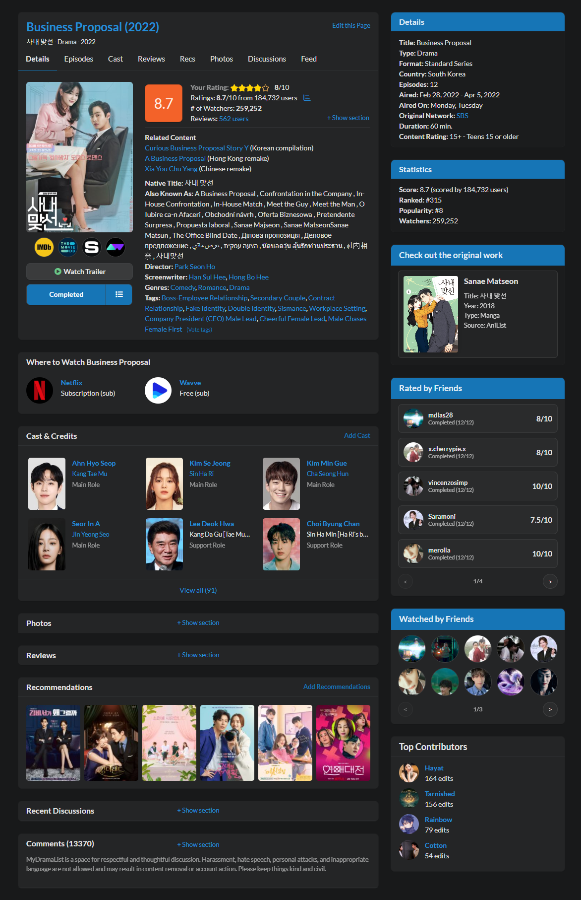
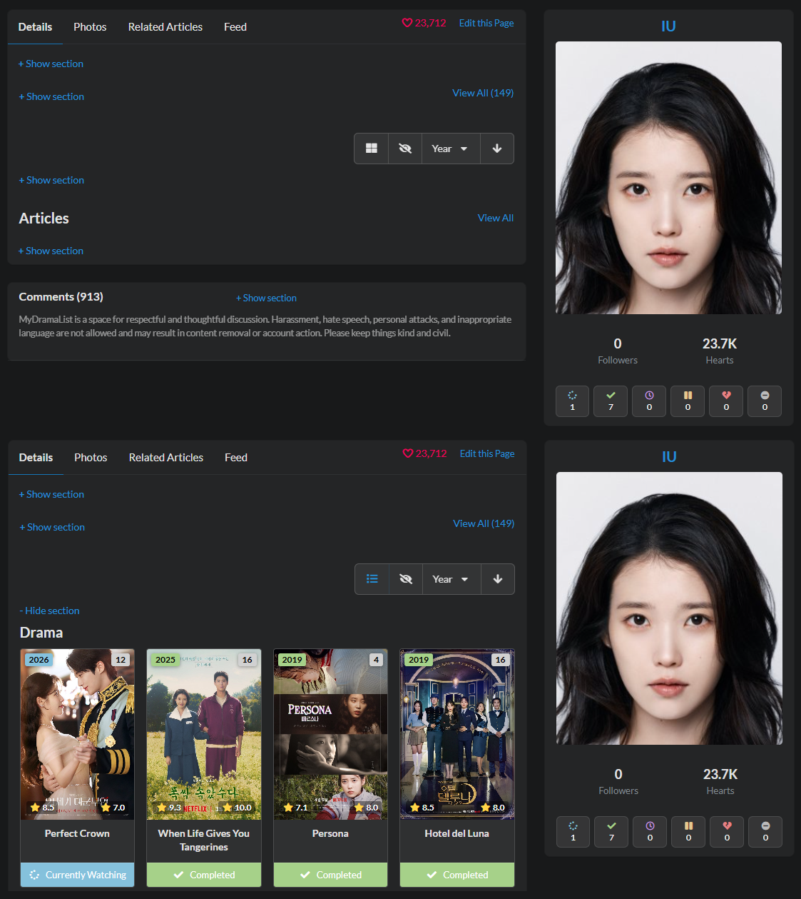
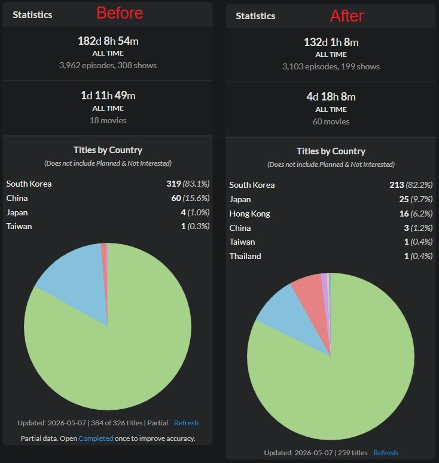
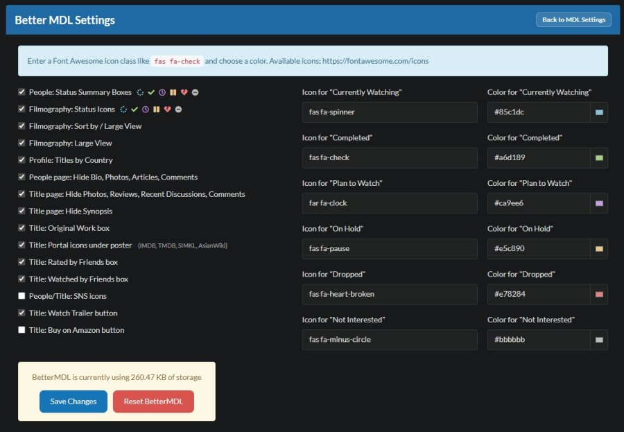

# BetterMDL

A lightweight MyDramaList userscript by **David33** that adds useful UI improvements for title pages, people pages, profiles, and drama lists.

## Features

### People Pages

- Status Summary Boxes
- Filmography Status Icons
- Filmography Sort by / Large View
- Filmography Large View
- Hide/Show Bio, Photos, Articles, Comments
- SNS Icons

### Title Pages

- Original Work Box
- Portal Icons under Poster
- Rated by Friends Box
- Watched by Friends Box
- Optional Native Title First title header
- Hide/Show "Watch Trailer Button"
- Hide/Show "Buy on Amazon Button"
- Hide Photos, Reviews, Recent Discussions, Comments
- Hide Synopsis


### Profile Pages

- Titles by Country Stats

### Filmography Tools

- Sort by Title
- Sort by Year
- Sort by Episodes
- Sort by Rating
- Ascending / Descending Sort
- Hide Completed Titles
- Large Poster/Card View

### Settings

- Enable / Disable BetterMDL features
- Customize status icons
- Customize status colors
- Customize the Watchlist Undecided label
- Hide/Show Support for every feature
- Reset settings
- Clear BetterMDL cache

## Install

1. Install a userscript manager:
   - Tampermonkey
   - Violentmonkey
   - ScriptCat

2. Open the script file:

```text
BetterMDL-By-David33.user.js
```

> Note: For full "Titles by Country" statistics to work, open your Completed, Currently Watching, On Hold, and Dropped lists, slowly scroll through each page until everything loads, then return to your profile and click Refresh. This allows BetterMDL to collect the full data and show accurate country stats.


## Screenshots







## Links

[Greasy Fork](https://greasyfork.org/en/scripts/574654-bettermdl-v1-2-26-by-david33/code)
[MyDramaList Forum](https://mydramalist.com/discussions/general-discussion/88611-gathering-feedbacks?pid=3514580&page=15#p3514580)


## Sponsor

[](https://ko-fi.com/N4N0XO52O)
